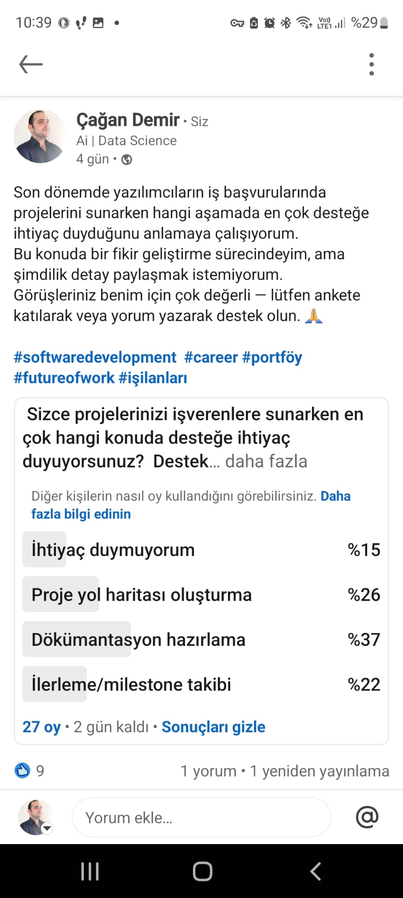

# 🧠 GRUP148 – PROJEKA - AI Destekli Kariyer Yönlendirme Platformu

## 🎯 Proje Amacı

Üniversite öğrencilerini gerçek iş ilanlarına göre yönlendiren, sektörel verilerle desteklenmiş, AI tabanlı proje fikirleri ve README çıktıları sunan kişiselleştirilmiş bir kariyer destek platformu geliştirmek.

## 🌍 Hedef Kitle

- Yazılım veya veri alanında kariyer hedefleyen öğrenciler
- Yeni mezunlar
- Alan değiştirmek isteyen bireyler

## 🛠️ Kullanılan Teknolojiler

- Python 
- FastAPI (Backend)
- PostgreSQL (Veri tabanı)
- Gemini Pro API (LLM entegrasyonu)"
- HTML/CSS veya Streamlit (Frontend)
  

# 👥 Takım Üyeleri

| İsim             | Rolü                     | Sorumluluklar |
|------------------|--------------------------|----------------|
| Murat Ertuğrul   | Scrum Master             | Süreç yönetimi, günlük takibin yapılması, engel çözümü |
| Çağan Demir      | Product Owner / LLM      | Ürün vizyonu, prompt tasarımı, proje çıktıları |
| Damla Söylemez   | Veri ve LLM              | Veri temizliği, model çıktısı hazırlığı |
| Sevilay Mete     | Veritabanı & Backend     | PostgreSQL kurulumu, veri şeması |
| Dilara Yavuz     | Frontend                 | Arayüz tasarımı, çıktı sunumu |

---

# 🟩 Sprint 1 Raporu

## 🟩 Sprint 1 Notları
Bu sprintte proje için temel yapı oluşturuldu. Geliştirme ortamı hazırlandı, kullanıcı arayüzü taslakları belirlendi ve ilk işlevsel modül olan kullanıcı giriş sistemi geliştirildi. Sprint sonunda planlanan işlerin büyük çoğunluğu tamamlandı, eksik kalan görevler bir sonraki sprint'e aktarıldı.

## 🔎 Sprint Hedefleri

- Veri toplama ve anonimleştirme
- PostgreSQL kurulumu ve şema yapısı
- FastAPI temel uçlarının oluşturulması

## ✅ Gerçekleştirilen Görevler

- [x] FastAPI iskeleti oluşturuldu
- [x] `/register`, `/login`, `/get_jobs` uçları hazırlandı
      
## 🔢 Story Point Tahminleri

| Görev                                | SP  | Durum     |
|--------------------------------------|-----|-----------|
| PostgreSQL kurulumu                  | 3   | ❌ Tamamlanmadı |
| FastAPI kullanıcı kayıt/giriş uçları | 5   | ✅ Tamamlandı |
| FastAPI kullanıcı uçları             | 5   | ✅ Tamamlandı |
Toplam SP hedefi: **13**  
Tamamlanan: **10 SP** → Başarı oranı: **%76,92**

## 🧠 Tahmin Mantığı

Story point'ler; teknik karmaşıklık, zaman tahminine göre belirlendi. Story pointler Fibonacci dizisi ile değerlendirildi.

## 🕓 Daily Scrum Özetleri

Takım olarak günlük toplantılarımızı genellikle Google Meet üzerinden gerçekleştirdik. Toplantılarda her ekip üyesi o gün üzerinde çalıştığı görevleri, yaşadığı engelleri ve bir sonraki adımını paylaştı. Toplantı dışında takım içi iletişim ağırlıklı olarak WhatsApp üzerinden sağlandı. Trello üzerinden ayrı bir daily panosu açıldı.

## 📋 Sprint Board

## 🔄 Sprint Review

Bu sprintin sonunda geliştirilen işlevler takım ve paydaşlarla birlikte gözden geçirildi. Kullanıcı giriş sistemi başarıyla tamamlandı ve test edildi. LLM üzerinde olumlu geri bildirimler alındı. Postgre bir sonraki sprint'e aktarılması kararlaştırıldı.  Anket sonuçları incelendi.

## 🔄 Sprint Retrospective

Sprint sonunda takım olarak süreçlerimizi değerlendirdik. Bu sprintte takım içi iletişim ve görev dağılımı kısmen başarılı şekilde yürütüldü. İletişim düzenli olarak devam etti ve önemli görevler zamanında tamamlandı. Takım olarak toplantıların daha etkili ve yoğun geçmesini kararlaştırdık. Görevlerde değişimlere gittik.

---

📝 Sprint 2’de LLM entegrasyonu ve proje çıktılarının kişiselleştirilmiş olarak sunulması hedeflenmektedir.
